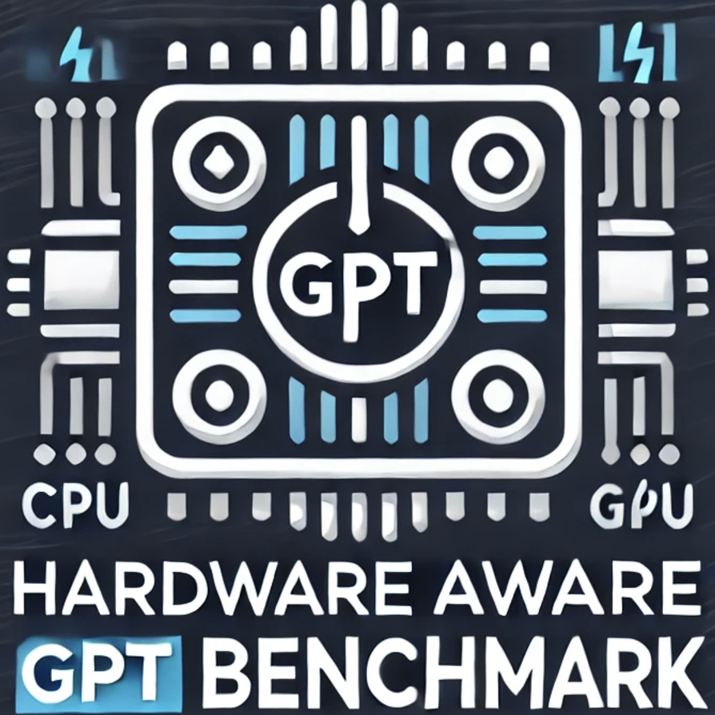
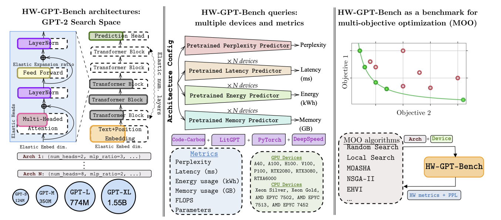

# HW-GPT-Bench
## Repository for [HW-GPT-Bench](https://arxiv.org/abs/2405.10299)- NeurIPS DBT 2024


### *Note: We are in the process of updating the benchmark and code, with significant changes to the repository coming soon!*
## Repository directory structure 

```
HW-GPT-Bench
   ├── baselines
   ├── configs 
   ├── data_collection
   ├── downstream_eval
   ├── hwgpt
   ├── lib
   ├── pl_gpt
   ├── plotting
   ├── scripts
```
```baselines``` folder contains python scripts to run different baselines on HW-GPT-Bench using [syne-tune](https://github.com/syne-tune/syne-tune)

```configs``` folder contains supernet and device configs for collection of perplexities, profiling of latencies, energies and memory on devices and supernet training 

```data_collection``` folder contains the raw data and small mlp surrogates. Please refer to supernet and surrogate downloading instructions for downloading the larger surrogates and checkpoints. In addition this folder also contains the scripts used to profile energies, latencies and memory

```downstream_eval``` contains an example to evaluate an architecture from hw-gpt-bench on downstream task using the [whittle](https://github.com/whittle-org/whittle/) api. 

```hwgpt``` folder contains the central api of hw-gpt-bench

```lib``` contains utils functions for the api

```plotting``` contains scripts used for creating plots used in the paper

```scripts``` contains example scripts for different multi-objective baselines using hw-gpt-bench

## Supernet Checkpoints and Pretrained Surrogates

| Resource                     | Description                         | Link                                                                                     |
|------------------------------|-------------------------------------|------------------------------------------------------------------------------------------|
| **Supernet Checkpoints**     | Pretrained supernet checkpoints.   | [Download Here](https://drive.google.com/drive/folders/1uUxO05Hx-T_KOiTkA3zT_iuaeK6HdxM0?usp=sharing) |
| **Hardware Surrogates**      | Pretrained hardware surrogates.    | [Download Here](https://drive.google.com/drive/folders/1asANcSevV90OLwmPkbTnWUo_M-PdtVSD?usp=sharing) |
| **Perplexity Surrogates**    | Pretrained perplexity surrogates.  | [Download Here](https://drive.google.com/file/d/1-Z998sYUprA5fuogLElQfAYq7Z29XqUg/view?usp=sharing) |
| **Sampled Architectures**    | List of architectures sampled.     | [Download Here](https://drive.google.com/drive/folders/1Y54MN4ybpUs_pCuElworFvc5ZeoN2amu?usp=sharing) |

Once the AutoGluon surrogates are downloaded, move them to the following folder ```HW-GPT-Bench/data_collection/gpt_datasets/predictor_ckpts/hwmetric/autogluon/```

### Example Command for hardware surrogate download
Use the following commands to download the surrogates to correct directories:

```bash
$ gdown 1s1jzJwL5zv4McbwLBbZd03Z2wc-fh0Bj
$ unzip -qq gpt_energies_l_rtx3080_log.zip
$ mkdir -p HW-GPT-Bench/data_collection/gpt_datasets/predictor_ckpts/hwmetric/autogluon
$ mv HW-GPT-Bench/gpt_energies_l_rtx3080_log HW-GPT-Bench/data_collection/gpt_datasets/predictor_ckpts/hwmetric/autogluon/
```


## Installation Instructions
1. To install the **minimal requirements**, use the `requirements-min.txt` file.
2. For **full installation**, ensure you are using a GPU node with CUDA module loaded, as it requires building some packages.
```sh
$ git clone https://github.com/automl/HW-GPT-Bench/
$ cd HW-GPT-Bench
$ conda create -n hw-gpt python=3.11.9
$ conda activate hw-gpt
$ pip install -e .
```
To install syne-tune use the following steps
```sh
git clone https://github.com/awslabs/syne-tune.git
cd syne-tune
pip install -e '.[basic]'
```

## Example api usage
```python
from hwgpt.api import HWGPT
api = HWGPT(search_space="s",use_supernet_surrogate=False) # initialize API
random_arch = api.sample_arch() # sample random arch
api.set_arch(random_arch) # set  arch
results = api.query() # query all for the sampled arch
print("Results: ", results)
energy = api.query(metric="energies") # query energy
print("Energy: ", energy)
rtx2080 = api.query(device="rtx2080") # query device
print("RTX2080: ", rtx2080)
# query perplexity based on mlp predictor
perplexity_mlp = api.query(metric="perplexity",predictor="mlp")
print("Perplexity MLP: ", perplexity_mlp)
```

## Colab notebook demo

We provide a minimal [colab-notebook](https://colab.research.google.com/drive/1evdb9oQ0y8Mg_gQVaZiHdS_5iuxGKmrf?usp=sharing) to use the api in a notebook. Note however that colab notebook has a different python version installed and it is recommended to use the environment and requirements specified in the installation instructions. 

## Citation 
If you find HW-GPT Bench useful, you can cite us using:

```
@inproceedings{
sukthanker2024hwgptbench,
title={{HW}-{GPT}-Bench: Hardware-Aware Architecture Benchmark for Language Models},
author={Rhea Sanjay Sukthanker and Arber Zela and Benedikt Staffler and Aaron Klein and Lennart Purucker and J{\"o}rg K.H. Franke and Frank Hutter},
booktitle={The Thirty-eight Conference on Neural Information Processing Systems Datasets and Benchmarks Track},
year={2024},
url={https://openreview.net/forum?id=urJyyMKs7E}
}
```
