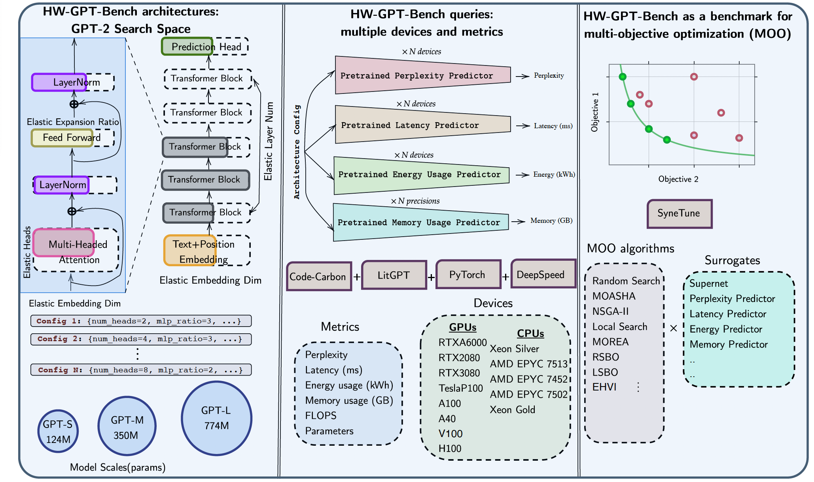

# HW-GPT-Bench
## Repository for [HW-GPT-Bench](https://arxiv.org/abs/2405.10299)- NeurIPS DBT 2024

### *Note: We are in the process of updating the benchmark and code, with significant changes to the repository coming soon!*
## Supernet Checkpoints and Pretrained Surrogates
We release the pretrained supernet checkpoints [here](https://drive.google.com/drive/folders/1uUxO05Hx-T_KOiTkA3zT_iuaeK6HdxM0?usp=sharing), the pretrained hardware surrogates [here](https://drive.google.com/file/d/1-HXev4sdoDf_nwDJoBdlK1eKIOFN5K00/view?usp=sharing) and the perplexity surrogates [here](https://drive.google.com/file/d/1-Z998sYUprA5fuogLElQfAYq7Z29XqUg/view?usp=sharing) and the list of architectures sampled [here](https://drive.google.com/drive/folders/1Y54MN4ybpUs_pCuElworFvc5ZeoN2amu?usp=sharing). 


## To install in editable mode (-e) run:

```sh
$ git clone https://github.com/automl/HW-Aware-LLM-Bench
$ cd HW-Aware-LLM-Bench
$ pip install -e .
```

## Example api usage
```python
from hwgpt.api import HWGPT
api = HWGPT(search_space="s",use_supernet_surrogate=False) # initialize API
random_arch = api.sample_arch() # sample random arch
api.set_arch(random_arch) # set  arch
results = api.query() # query all for the sampled arch
print("Results: ", results)
energy = api.query(metric="energies") # query energy
print("Energy: ", energy)
rtx2080 = api.query(device="rtx2080") # query device
print("RTX2080: ", rtx2080)
# query perplexity based on mlp predictor
perplexity_mlp = api.query(metric="perplexity",predictor="mlp")
print("Perplexity MLP: ", perplexity_mlp)
```
## Citation 
If you find HW-GPT Bench useful, you can cite us using:

```
@article{sukthanker2024hw,
  title={HW-GPT-Bench: Hardware-Aware Architecture Benchmark for Language Models},
  author={Sukthanker, Rhea Sanjay and Zela, Arber and Staffler, Benedikt and Klein, Aaron and Franke, Jorg KH and Hutter, Frank},
  journal={arXiv preprint arXiv:2405.10299},
  year={2024}
}
```
